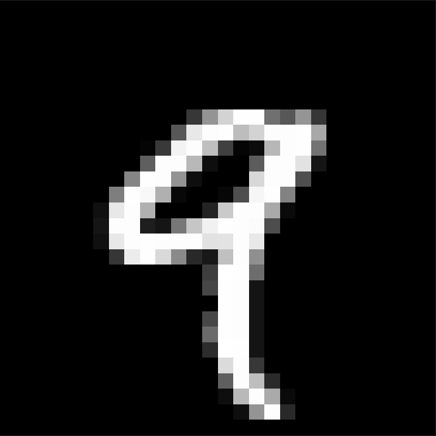
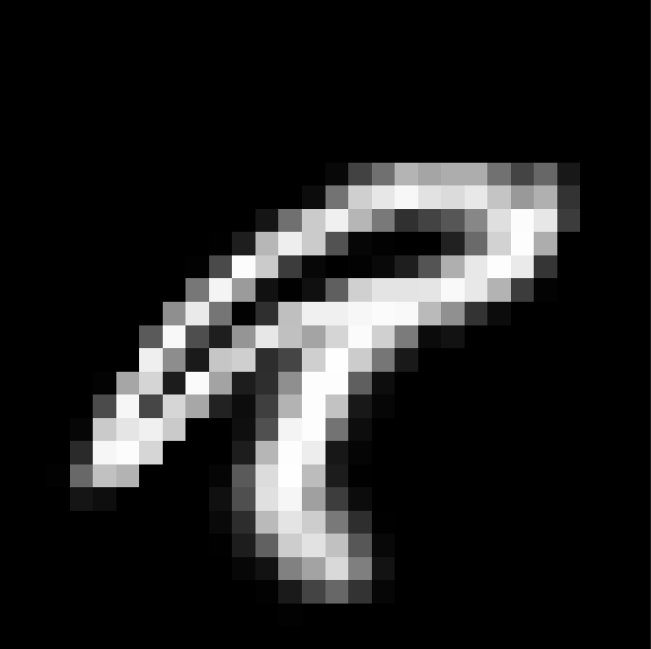

# Elastic Deformation

## 概要

手書き文字を「Elastic Deformation」することにより，人為的に変形させる．

PRML：p.263 - Fig 5.14 での変形を実装したものになる．

## 仕様

### 方針
変位場を作成してそれをもとに元の画像を歪ませる．
  
  1. まず画像の各ピクセルごとにランダムな変位 $\Delta x ,\Delta y \in (0, 1)$ を生成する．
  2. その後，その変位場を様々な分散 $\sigma^2$ のガウシアンフィルタと畳み込み，平滑化する．
  3. 平滑化した変位場を用いて手書き数字の画像を歪ませる（バイリニア補間を使用）．
  この際，テキストには記載されていないが変位場をスケール係数 $\alpha$ を用いて拡大しておく必要がある．

### $\alpha, \sigma$ の関係

1. $\sigma \lt 1$ ならばらばら（まとまりがない）
2. $\sigma \gg 1$ (10程度) ならまとまりを持って変形
3. $\alpha \gt \sigma$ がよい 
　( $\alpha = \sigma^2$ とかがいいかも $\Rightarrow$ 若干押しつぶされた感じになる) 
　( $\alpha = 2 \sigma^2 ～ 3\sigma^2$ で結構変形する)
　→ これは $\sigma$ が大きくなると変位場への畳み込みの際の係数も全体的に小さくなるため（多分）
4. $\alpha \gg \sigma$ だとぐっちゃぐち
5. $\sigma \gg \alpha$ だと変わらなすぎ

> テキスト中の 幅(width) はおそらく分散に対応

## 実行例

### オリジナル

### 変形後

## 問題点

上手く保存ができない．

## データの引用元

手書き数字データ：[QMNIST](https://github.com/facebookresearch/qmnist)

## その他

arrayから画像オブジェクトを生成：[PILリファレンス](https://pillow.readthedocs.io/en/stable/handbook/concepts.html#modes)